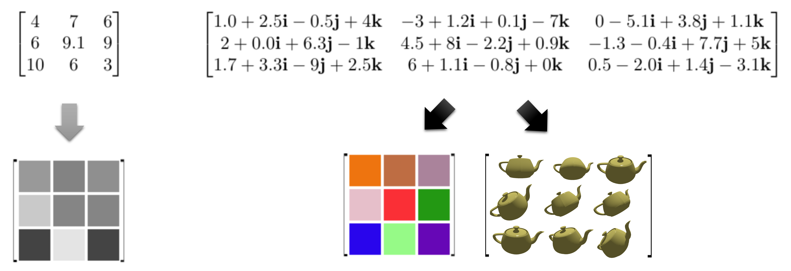
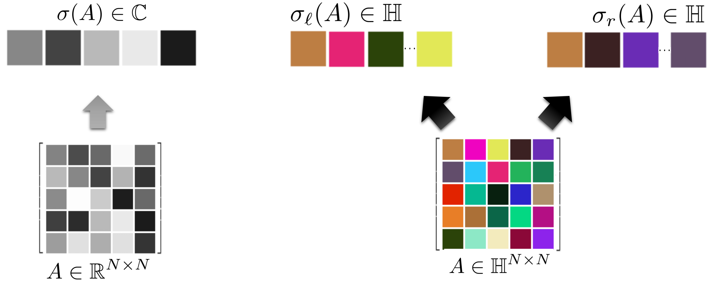
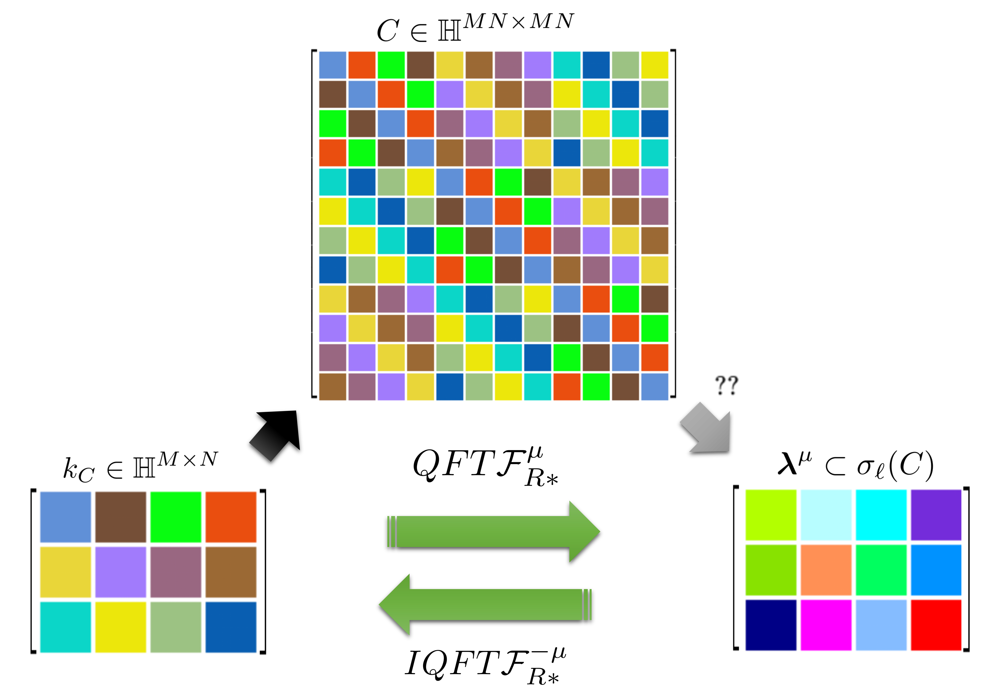
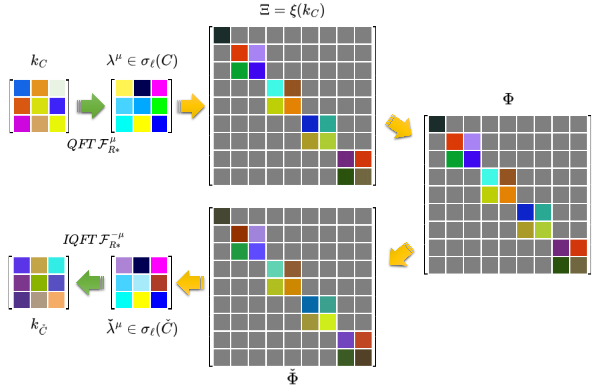

<div align="center">
<h1>Unlocking the matrix form of the Quaternion Fourier Transform and Quaternion Convolution: Properties, connections, and application to Lipschitz constant bounding</h1>

<p>This is the official implementation for the theoretical tools introduced and discussed in the paper by Giorgos Sfikas and George Retsinas: <em>"Unlocking the matrix form of the Quaternion Fourier Transform and Quaternion Convolution: Properties, connections, and application to Lipschitz constant bounding"</em> (accepted to the <strong>Transactions on Machine Learning Research Journal (TMLR)</strong>, 2025)</p>
</div>
<p align="center">
  <a href="https://openreview.net/forum?id=rhcpXTxb8j"></a>
  <a href="https://arxiv.org/abs/2307.01836"></a>
  <a href="LICENSE"></a>
</p>


**TL;DR**: *We show how the relation of convolution, circulant matrices and the Fourier transform generalizes to the quaternionic domain. A Lipschitz constant bounding application acts as a proof-of-concept of the usefulness of our results*.

<hr>

<!-- -->
<p align="center"> 
 <br>
        Matrices of real-valued elements (top left) form a standard representational unit
        for unidimensional data, such as grayscale pixels (bottom left), neural network weights or other unidimensional signals.
        Matrices of quaternion-valued elements (top right) represent an arrangement of multidimensional data
        such as colour images or 3D spatial rotation (bottom right).
</p>
<br> 

<hr>

<p align="center"> 
 <br>
        The whole is more than the sum of its parts:
        Quaternionic matrix eigenstructure is significantly richer  than the eigenstructure of real matrices.
        The set of all eigenvalues of a real-valued matrix forms the spectrum $\sigma(\cdot)$ of the matrix;
        for real-valued (and complex-valued) matrices, it is a subset of $\mathbf{C}$.
        In quaternionic matrices, we have two distinct spectra, the left spectrum $\sigma_\ell(\cdot)$ and the right spectrum $\sigma_r(\cdot)$ , corresponding to forms $Ax = \lambda x$ and $Ax = x\lambda$ respectively.
        No known well-posed connection exists that relates the two spectra, and in general they can both be infinite sets.
        The literature focuses on right eigenvalues,
        as no general method exists to compute the left spectrum.
        In this paper, our focus turns to the usefulness of the left spectrum, 
        which we show how to compute efficiently in the %context of circulant structures.
        case of circulant-structured matrices.
</p>
<br>

<hr>

<p align="center"> 
 <br>
        Quaternion convolution kernel $k_C$ (left) is related to doubly-block circulant matrix $C$ (top).
        In this work, we show that the left spectrum (right) of any $C$ can be accessed via applying a QFT over kernel $k_C$.
        Furthermore, the kernel can be reconstructed exactly via IQFT.
        This provides a fast and accurate way to access spectral characteristics of convolution,
        completely bypassing the construction and manipulation of the (quadratically increasing)
        doubly-block circulant $C$.
</p>

<hr>

<br>
<p align="center"> 
 <br>
        A visual summary of the procedure that forms the backbone of the Lipschitz constant-bounding method,
        enabled with our results.
        Given a quaternionic convolution kernel $k_C$ (top left), we compute left eigenvalues $\mathbf{\lambda}^\mu$ via the QFT with axis $\mu \in \mathbf{H}$.
        From our left eigenvalues we construct matrix $\Xi$, then matrix $\Phi$ (see in-text for details).
        Crucially, matrix $\Phi$ has the same singular values with doubly-block convolutional matrix $C$,
        but is much easier to construct and manipulate due to its block diagonal structure, with blocks sized either $1\times 1$ or $2\times 2$.
        Spectrum manipulation is thus performed over $\Phi$ to obtain $\check{\Phi}$,
        and in turn we obtain new left eigenvalues $\check{\mathbf{\lambda}^\mu}$.
        Finally, we apply IQFT to obtain the quaternionic convolution kernel that corresponds to the manipulated/clipped convolution $k_{\check{C}}$.
        The result is a method that is more economical in terms of space and time requirements by orders of magnitude,
        related a process that would be oblivious to these results.
</p>
<br>

## Paper Abstract

Linear transformations are ubiquitous in machine learning, and matrices are the standard way to represent them.
In this paper, we study matrix forms of quaternionic versions of the Fourier Transform and Convolution operations.
Quaternions offer a powerful representation unit, however they are related to difficulties in their use that stem foremost from non-commutativity of quaternion multiplication, 
and due to that $\mu^2 = -1$ possesses infinite solutions in the quaternion domain.
Handling of quaternionic matrices is consequently complicated in several aspects (definition of eigenstructure, determinant, etc.).
Our research findings clarify the relation of the Quaternion Fourier Transform matrix to the standard (complex) Discrete Fourier Transform matrix,
and the extend on which well-known complex-domain theorems extend to quaternions.
We focus especially on the relation of Quaternion Fourier Transform matrices to Quaternion Circulant matrices (representing quaternionic convolution), and the eigenstructure of the latter.
In the paper, a proof-of-concept application that makes direct use of our theoretical results is presented,
where we present a method to bound the Lipschitz constant of a Quaternionic Convolutional Neural Network.


## 💡 Project Overview

The code provides:
* An extensive **Python library** for working with quaternion matrix **eigenstructure**, the **quaternion Fourier transform**, create, visualize and manipulate **quaternion circulant matrices**.
* **Jupyter Notebooks** that demonstrate and numerically validate the main theoretical propositions presented in the paper.
* Routines to efficiently **evaluate the spectral norm** of a quaternion convolution operation, apply **clipping** and **Lipschitz constant bounding**.

The code makes use of the [quaternion numpy library](https://github.com/moble/quaternion).
***

## 📚 Repository Contents

The repository is structured to separate the core utilities from the demonstration notebooks:

| File/Folder | Description |
| :--- | :--- |
| `quaternion_matrix.py` | Core class for quaternion matrix algebra. |
| `quaternion_circulant_matrix.py` | Implementation of the Quaternion Circulant Matrix. |
| `quaternion_symplectic.py` | Implementation of quaternion symplectic operations. |
| `circulant.py` | Utility functions for standard circulant matrices. |
| `requirements.txt` | Python dependencies for setting up the environment. |
| `QFourier Notebook 01-09...ipynb` | **Demonstration Notebooks**: numerical validation and demonstrators of the paper's propositions. |

### Key Demonstrations (Notebooks)

The following Jupyter Notebooks serve to demonstrate the key theoretical results of the paper:

| Notebook | Focus/Proposition |
| :--- | :--- |
| `QFourier Notebook 01` | Visualization of quaternion circulant matrices (1/2). |
| `QFourier Notebook 02` | Visualization of quaternion circulant matrices (2/2). |
| `QFourier Notebook 03` | **Propositions 3.1/3.2** Quaternion convolution as product of a circulant x vectorized input, and linear combination of permutation matrices. |
| `QFourier Notebook 04` | **Proposition 3.3:** General properties of the Quaternion Fourier Matrix. |
| `QFourier Notebook 05` | **Proposition 3.4:** All QFT matrices are connected via a rotation $pQ\bar{p}$|
| `QFourier Notebook 06` | **Propositions 3.5/3.6:** The eigenstructure of Quaternionic Circulant matrices and relation to Quaternion Fourier matrices. |
| `QFourier Notebook 07` | **Proposition 3.7:** Properties of sums and products of Quaternion Circulant matrices. |
| `QFourier Notebook 09` | **Propositions 4.3/4.4:** Implementation of spectral norm clipping for Lipschitz constant bounding. |
| `QFourier Notebook A0` | A simple demonstration of the QFT (1/2). |
| `QFourier Notebook A1` | A simple demonstration of the QFT (2/2). |


***

## ⚙️ Installation and Setup

To clone the repository and set up the necessary Python environment, follow these steps:

1.  **Clone the repository:**
    ```bash
    git clone [https://github.com/sfikas/quaternion-fourier-convolution-matrix.git](https://github.com/sfikas/quaternion-fourier-convolution-matrix.git)
    cd quaternion-fourier-convolution-matrix
    ```

2.  **Create and activate a virtual environment (Recommended):**
    ```bash
    python3 -m venv venv
    source venv/bin/activate
    ```

3.  **Install the required packages:**
    ```bash
    pip3 install -r requirements.txt
    ```

***

## 🏃 Getting Started (Usage)

All usage examples are demonstrated within the **Jupyter Notebooks**.

1.  Start the Jupyter Notebook server:
    ```bash
    jupyter notebook
    ```
2.  Navigate to the project directory in your browser.
3.  Open any of the `QFourier Notebook XX...ipynb` files to review and run the code. 
The notebooks can be executed sequentially to follow the paper's flow.

***

## 📜 Citation

If you use this code or the concepts from the paper in your research, please cite the original work:

```bibtex
@article{sfikas2025unlocking,
  title={Unlocking the matrix form of the Quaternion Fourier Transform and Quaternion Convolution: Properties, connections, and application to Lipschitz constant bounding},
  author={Sfikas, Giorgos and Retsinas, George},
  journal={Transactions on Machine Learning Research Journal (TMLR)},
  year={2025}
}
```

## Contact

For questions or issues, please open an issue on GitHub.

## License

This project is licensed under the MIT License.